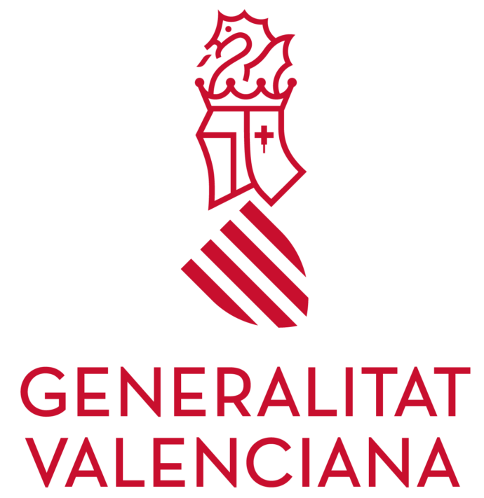

# 💡 LightVED — PRHLT Research Group

Bienvenidos al repositorio de presentación del proyecto **LightVED**, desarrollado por el grupo de investigación **PRHLT** (Pattern Recognition and Human Language Technologies) de la Universitat Politècnica de València (UPV). Este repositorio actúa como una **tarjeta de presentación del proyecto y sus líneas de trabajo**.

## 🧭 Descripción del proyecto

**LightVED** (*Lightweight Vision Encoder-Decoder*) es una iniciativa de investigación centrada en mejorar los modelos **encoder-decoder** que conectan visión por computador y procesamiento de lenguaje natural. Nuestro objetivo es crear arquitecturas ligeras y eficientes que permitan aplicaciones prácticas con menor coste computacional.

### 🔬 Líneas de investigación

- 🏥 Procesamiento multimodal (visión + lenguaje) para la investigación médica
- 🧠 Compresión de arquitecturas Transformer aplicadas a visión y lenguaje
- 🧾 Reconocimiento de texto manuscrito (HTR, HDR)
- 👄 Lip reading basado en vídeo

## 📝 Publicaciones

📚 Si quieres conocer las publicaciones del proyecto visita la siguiente [página web](https://lightved-prhlt.github.io/publications/).

## 👥 Equipo de investigación

Este proyecto está liderado por investigadores del grupo **PRHLT-UPV**:

- 👨‍🏫 Roberto Paredes Palacios (IP)
- 👨‍🏫 Alberto Albiol Colomer (IP2)
- 👨‍🏫 Carlos Martínez, José M. Benedí, Joan A. Sánchez, Paolo Rosso

Además, colaboran investigadores predoctorales y técnicos especializados en visión y lenguaje:

- 👨🏻‍💻 Mohamed Aas Alas
- 👨🏻‍💻 Luis Jesús Marhuenda Tendero
- 👨🏻‍💻 Miquel Obrador Reina
- 👨🏻‍💻 David Gimeno Gómez

> Más información sobre el equipo en la [página web](https://lightved-prhlt.github.io/team/) del proyecto

## 📬 Contacto

📨 Email: info@prhlt.upv.es  
🌐 Web del proyecto: [https://lightved-prhlt.github.io](https://lightved-prhlt.github.io/)  
🌐 Web del grupo: [https://www.prhlt.upv.es](https://www.prhlt.upv.es)  
📍 Universitat Politècnica de València, España

## 🙏 Agradecimientos

🏛️ Este proyecto ha sido subvencionado por el programa PROMETEO (CIPROM/2023/17) de la Generalitat Valenciana.

    
    
     <!-- arriba derecha abajo izquierda -->

---

📌 *Este repositorio está en constante actualización. Última revisión: [Junio, 2025]*
